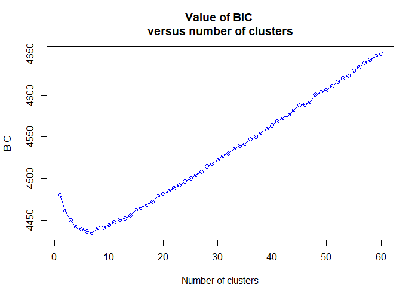

```{r setup, include=FALSE}
knitr::opts_chunk$set(echo = TRUE)
```

## Introduction

This tutorial uses the same dataset as a tutorial that I gave at a workshop in
January 2021, which can be watched on
[YouTube](https://www.youtube.com/watch?v=vjwFBspNpRc). It consists of RAD-seq
data on a diversity panel consisting mostly of wild-collected
_Miscanthus sacchariflorus_ (Clark et al. 2018, https://doi.org/10.1093/aob/mcy161,
https://doi.org/10.13012/B2IDB-0170190_V3, https://doi.org/10.13012/B2IDB-8170405_V1).

In addition to loading polyRAD, we'll load some other packages for population genetics
and making plots.  The polyRADtutorials package is not on CRAN but can be installed from
GitHub or R-universe, and contains the dataset.

```{r libs, message = FALSE}
library(polyRAD)
library(adegenet)
library(polyRADtutorials)
library(ggplot2)
library(maps)
library(pegas)
library(PBSmapping)
library(spdep)
```

Here we'll load the read depth data and collection location information.

```{r data}
data("Msa_4x_chr3")
mydata <- Msa_4x_chr3
rm(Msa_4x_chr3)
mydata

data("Msa_latlong")
head(Msa_latlong)
Msa_latlong$Accession <- as.character(Msa_latlong$Accession)
```

We'll also load some geographical data, namely the borders of East Asian
countries where these samples were collected.  This will be used for plotting
later.

```{r borders}
east_asia <- map_data("world")
summary(Msa_latlong)
east_asia <- east_asia[east_asia$long > 115 & east_asia$long < 146 &
                         east_asia$lat > 28 & east_asia$lat < 50,]

# prevent some ugly lines in the map
east_asia$group2 <- integer(nrow(east_asia))
j <- 1L
for(i in seq_len(nrow(east_asia))){
  if(i != 1L && east_asia$order[i] - east_asia$order[i - 1L] != 1L){
     j <- j + 1L
  }
  east_asia$group2[i] <- j
}
```


## Filtering

### Samples

In my video tutorial with this data, I filtered some samples that appeared
highly heterozygous.

```{r hh_sample}
hh <- HindHe(mydata)

TotDepthT <- rowSums(mydata$locDepth)

hhByInd <- rowMeans(hh, na.rm = TRUE)

plot(TotDepthT, hhByInd, log = "x",
     xlab = "Depth", ylab = "Hind/He", main = "Samples")
```

However, since this is a population genetics study and not a GWAS study,
maybe I'm looking for inter-species hybrids.  Let's keep them in that case.
(Of course, identification would be easier if I had some individuals of other
species as well.)  Which ones are they?

```{r highhh}
hhByInd[hhByInd > 0.8]
```

Let's add all of the values to our sample table.

```{r tablehh}
Msa_latlong$HindHe <- hhByInd
```

### Markers

In my video tutorial I also filtered markers that appeared to be collapsed
paralogs.  Let's still do that.

```{r hh_locus}
hh2 <- HindHe(mydata)

hhByLoc <- colMeans(hh, na.rm = TRUE)

hist(hhByLoc, breaks = 30)

InbreedingFromHindHe(0.65, 4)

set.seed(528)
ExpectedHindHe(mydata, inbreeding = 0.133)

thresh1 <- 0.523
thresh2 <- 0.715

keeploci <- names(hhByLoc)[hhByLoc > thresh1 & hhByLoc < thresh2]

mydata <- SubsetByLocus(mydata, keeploci)
mydata
```

## Genotype calling

Since this is a collection of wild plants, `IteratePopStruct` will be the most
accurate way to call genotypes.

```{r iteratepopstruct}
mydataPopStruct <- IteratePopStruct(mydata, overdispersion = 10)
```

However... I plan to use my genotypes to estimate population structure, when I
just used population structure to estimate my genotypes.  It's kind of circular.
Will a reviewer have a problem with it?  Maybe.  Think about it, anyway.  If you
would rather use a naive method to call genotypes, do this:

```{r naive}
mydataNaive <- AddGenotypePriorProb_Even(mydata)
mydataNaive <- AddGenotypeLikelihood(mydataNaive, overdispersion = 10)
mydataNaive <- AddGenotypePosteriorProb(mydataNaive)
mydataNaive <- AddPloidyChiSq(mydataNaive)
```

We can take a look at the PCs that were used for genotype calling by the
population structure method.  This will give us an idea of patterns of
population structure that could be exaggerated using that calling method.
The first two axes are shown below, but I recommend exploring all seven
(or however many are generated with your dataset).

```{r checkpca}
identical(rownames(mydataPopStruct$PCA), Msa_latlong$Accession)
Msa_latlong <- cbind(Msa_latlong, mydataPopStruct$PCA)

ggplot() +
  geom_path(data = east_asia,
            mapping = aes(x = long, y = lat, group = group2),
            color = "black") +
  geom_point(data = Msa_latlong,
             mapping = aes(x = Longitude, y = Latitude, color = PC1)) +
  scale_color_viridis_c() +
  ggtitle("PC1")

ggplot() +
  geom_path(data = east_asia,
            mapping = aes(x = long, y = lat, group = group2),
            color = "black") +
  geom_point(data = Msa_latlong,
             mapping = aes(x = Longitude, y = Latitude, color = PC2)) +
  scale_color_viridis_c() +
  ggtitle("PC2")
```


## Analyses with adegenet

The R package adegenet has some nice analyses popular in population genetics.
Better still, many of them now work on simple data matrices, without
the need so use any of adegenet's built-in data classes.  So we'll generate
matrices of marker data from polyRAD and then go from there.

```{r getwmg}
matrixPopStruct <- GetWeightedMeanGenotypes(mydataPopStruct)
matrixNaive <- GetWeightedMeanGenotypes(mydataNaive)
```

### Discriminant analysis of principal components (DAPC)

First we'll run `find.clust` to identify likely cluster membership for each
sample.

```{r findclust1a, eval = FALSE}
clust1 <- find.clusters(matrixPopStruct, n.pca = nrow(matrixPopStruct))
```



```{r findclust1b, eval = FALSE}
clust2 <- find.clusters(matrixNaive, n.pca = nrow(matrixNaive))
```


Based on these curves, I chose six and four clusters for the population
structure and naive datasets, respectively.

```{r findclust2, echo = FALSE}
set.seed(529)
clust1 <- find.clusters(matrixPopStruct, n.pca = nrow(matrixPopStruct), n.clust = 6)
clust2 <- find.clusters(matrixNaive, n.pca = nrow(matrixNaive), n.clust = 4)
```

Now we will use these preliminary clusters to run DAPC.  You may choose to
omid the `n.pca` and `n.da` arguments in order to choose these values interactively.

```{r dapc}
dapc_PopStruct <- dapc(matrixPopStruct, clust1$grp,
                       n.pca = 200, n.da = 5)
dapc_Naive <- dapc(matrixNaive, clust2$grp,
                       n.pca = 200, n.da = 3)
```

We'll add the assignments to our sample table.

```{r dapctable}
Msa_latlong$DAPC_PopStruct <- dapc_PopStruct$assign
Msa_latlong$DAPC_Naive <- dapc_Naive$assign
```

We can visualize $H_{ind}/H_E$ by DAPC group in order to identify groups that
are likely to represent interspecies hybrids.

```{r dapcbarplots}
ggplot(Msa_latlong, aes(x = DAPC_PopStruct, y = HindHe, fill = DAPC_PopStruct)) +
  geom_boxplot()
ggplot(Msa_latlong, aes(x = DAPC_Naive, y = HindHe, fill = DAPC_Naive)) +
  geom_boxplot()
```

So with the population structure-aware genotypes, groups 4 and 6 are hybrids.
With the naive genotypes, group 1 is hybrids.  (The groups may be in a different
order for you.)

We can map these groups to see if they make sense geographically.

```{r dapcmap}
ggplot() +
  geom_path(data = east_asia,
            mapping = aes(x = long, y = lat, group = group2),
            color = "black") +
  geom_point(data = Msa_latlong,
             mapping = aes(x = Longitude, y = Latitude, color = DAPC_PopStruct))

ggplot() +
  geom_path(data = east_asia,
            mapping = aes(x = long, y = lat, group = group2),
            color = "black") +
  geom_point(data = Msa_latlong,
             mapping = aes(x = Longitude, y = Latitude, color = DAPC_Naive))
```

The extra clusters that we got from using the population structure-aware
genotypes don't seem to add meaningful information.

### Spatial principal coordinates analysis (sPCA)

sPCA is like PCA, but combines genetic and spatial information in order to
find more subtle patterns of geographic population structure.  To perform
this analysis, we will first need to convert latitude and longitude to UTM.
We'll choose a UTM zone central to the dataset; see
https://en.wikipedia.org/wiki/Universal_Transverse_Mercator_coordinate_system.
We'll also discard samples without collection location information.

```{r utm}
tempXY <- data.frame(Accession = Msa_latlong$Accession,
                     X = Msa_latlong$Longitude,
                     Y = Msa_latlong$Latitude)
tempXY <- tempXY[!is.na(tempXY$X),]
attr(tempXY, "projection") <- "LL"
attr(tempXY, "zone") <- 52
utmXY <- PBSmapping::convUL(tempXY)
summary(utmXY)
```

The interspecies hybrids will have a strong genetic signal that isn't related
to geography, so it is best to remove them from the analysis.  In case my
DAPC groupings change upon rerunning the analysis, I'll write some code to
identify the hybrid cluster.

```{r filthybrid}
hhByDAPC <- tapply(Msa_latlong$HindHe, Msa_latlong$DAPC_Naive, median)
hhByDAPC
hybridClust <- names(hhByDAPC)[hhByDAPC > 1]
hybridInd <- Msa_latlong$Accession[Msa_latlong$DAPC_Naive %in% hybridClust]

utmXY <- utmXY[!utmXY$Accession %in% hybridInd,]
str(utmXY)
```

We will jitter the positions since some accessions were collected at the same
site.

```{r jitter}
utmXY$X <- jitter(utmXY$X)
utmXY$Y <- jitter(utmXY$Y)
```

Now we need to build a connection network between collection sites.  I chose
the Gabriel graph (type 2 when prompted).

```{r chooseCN, eval = FALSE}
myCN <- chooseCN(utmXY[,c("X", "Y")])
```

```{r chooseCN2, echo = FALSE}
myCN <- chooseCN(utmXY[,c("X", "Y")], type = 2, plot.nb = TRUE)
```

Now we can run sPCA.  I recommend running first without the `nfposi`
and `nfnega` arguments so that you can chose these interactively.

```{r spca, warning = FALSE}
spca_PopStruct <- spca(matrixPopStruct[utmXY$Accession,], cn = myCN,
                       nfposi = 5, nfnega = 0, scannf = FALSE)
spca_Naive <- spca(matrixNaive[utmXY$Accession,], cn = myCN,
                   nfposi = 5, nfnega = 0, scannf = FALSE)
```

We'll add the results to our sample table.

```{r addspca}
temp <- matrix(NA_real_, nrow = nrow(Msa_latlong), ncol = 10,
               dimnames = list(Msa_latlong$Accession,
                               c(paste0("sPCA_PopStruct_", 1:5),
                                 paste0("sPCA_Naive_", 1:5))))
temp[rownames(spca_PopStruct$li),1:5] <- as.matrix(spca_PopStruct$li)
temp[rownames(spca_Naive$li),6:10] <- as.matrix(spca_Naive$li)
Msa_latlong <- cbind(Msa_latlong, temp)
```

Now we can visualize the first few axes.  The first two are similar to what we
got with the PCA done for genotype calling.  The fourth and fifth differ by
genotype calling method, so the first three are probably the most meaningful and
trustworthy.

```{r plotspca}
ggplot() +
  geom_path(data = east_asia,
            mapping = aes(x = long, y = lat, group = group2),
            color = "black") +
  geom_point(data = Msa_latlong,
             mapping = aes(x = Longitude, y = Latitude, color = sPCA_PopStruct_1)) +
  scale_color_viridis_c() +
  ggtitle("sPCA axis 1, PopStruct genotype calls")

ggplot() +
  geom_path(data = east_asia,
            mapping = aes(x = long, y = lat, group = group2),
            color = "black") +
  geom_point(data = Msa_latlong,
             mapping = aes(x = Longitude, y = Latitude, color = sPCA_PopStruct_2)) +
  scale_color_viridis_c() +
  ggtitle("sPCA axis 2, PopStruct genotype calls")

ggplot() +
  geom_path(data = east_asia,
            mapping = aes(x = long, y = lat, group = group2),
            color = "black") +
  geom_point(data = Msa_latlong,
             mapping = aes(x = Longitude, y = Latitude, color = sPCA_PopStruct_3)) +
  scale_color_viridis_c() +
  ggtitle("sPCA axis 3, PopStruct genotype calls")

ggplot() +
  geom_path(data = east_asia,
            mapping = aes(x = long, y = lat, group = group2),
            color = "black") +
  geom_point(data = Msa_latlong,
             mapping = aes(x = Longitude, y = Latitude, color = sPCA_PopStruct_4)) +
  scale_color_viridis_c() +
  ggtitle("sPCA axis 4, PopStruct genotype calls")

ggplot() +
  geom_path(data = east_asia,
            mapping = aes(x = long, y = lat, group = group2),
            color = "black") +
  geom_point(data = Msa_latlong,
             mapping = aes(x = Longitude, y = Latitude, color = sPCA_PopStruct_5)) +
  scale_color_viridis_c() +
  ggtitle("sPCA axis 5, PopStruct genotype calls")
```

```{r plotspca2}
ggplot() +
  geom_path(data = east_asia,
            mapping = aes(x = long, y = lat, group = group2),
            color = "black") +
  geom_point(data = Msa_latlong,
             mapping = aes(x = Longitude, y = Latitude, color = sPCA_Naive_1)) +
  scale_color_viridis_c() +
  ggtitle("sPCA axis 1, Naive genotype calls")

ggplot() +
  geom_path(data = east_asia,
            mapping = aes(x = long, y = lat, group = group2),
            color = "black") +
  geom_point(data = Msa_latlong,
             mapping = aes(x = Longitude, y = Latitude, color = sPCA_Naive_2)) +
  scale_color_viridis_c() +
  ggtitle("sPCA axis 2, Naive genotype calls")

ggplot() +
  geom_path(data = east_asia,
            mapping = aes(x = long, y = lat, group = group2),
            color = "black") +
  geom_point(data = Msa_latlong,
             mapping = aes(x = Longitude, y = Latitude, color = sPCA_Naive_3)) +
  scale_color_viridis_c() +
  ggtitle("sPCA axis 3, Naive genotype calls")

ggplot() +
  geom_path(data = east_asia,
            mapping = aes(x = long, y = lat, group = group2),
            color = "black") +
  geom_point(data = Msa_latlong,
             mapping = aes(x = Longitude, y = Latitude, color = sPCA_Naive_4)) +
  scale_color_viridis_c() +
  ggtitle("sPCA axis 4, Naive genotype calls")

ggplot() +
  geom_path(data = east_asia,
            mapping = aes(x = long, y = lat, group = group2),
            color = "black") +
  geom_point(data = Msa_latlong,
             mapping = aes(x = Longitude, y = Latitude, color = sPCA_Naive_5)) +
  scale_color_viridis_c() +
  ggtitle("sPCA axis 5, Naive genotype calls")
```

## Analysis of molecular variance (AMOVA) using pegas

In AMOVA, genetic distances between individuals or populations are
partitioned so that we can determine the amount of variance explained by
heirarchical groupings.  There are a few implementations in R, and we will
use the one from the pegas package here.

First we will get a matrix of Euclidean genetic distances between accessions.

```{r dist}
distNaive <- dist(matrixNaive, method = "euclidean")
```

Now we will regress that distance on the DAPC clusters.

```{r amova}
amovaNaive <- pegas::amova(distNaive ~ DAPC_Naive, data = Msa_latlong)
amovaNaive
```

We can see that these four DAPC clusters explain 11.5% of the molecular variance.
Significance is less than 0.001; we would have to do more permutations (`nperm`)
to determine it exactly.
